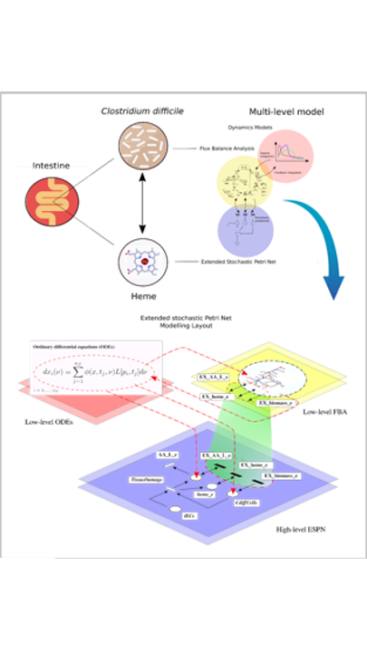

This page is under construction!!

# Introduction

The architecture of our new paradigm consists of three interconnected layers:  (i) the ESPN model, which acts as a meta-formalism to connect (ii) the ODEs model, and (iii) the FBA. We applied our framework to study host-pathogen interaction during CDI. In our case study, the ODEs-based approach was exploited to model the host intestinal environment, while FBA to solve C. difficile metabolism. Our framework allows the easy reproduction of metabolic reprogramming, such as the acquisition of a medium-dependent antibiotic-resistant phenotype following heme supplementation.

