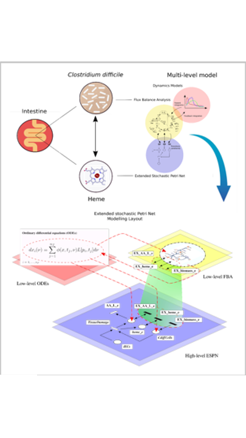

# UnifiedGreatMod for examining responses of luminal epithelial cells to *Clostridium difficile* infection

## Overview

The architecture of our new paradigm consists of three interconnected layers: (i) the ESPN model, which acts as a meta-formalism to connect (ii) the ODEs model, and (iii) the FBA. We applied our framework to study host-pathogen interaction during CDI. In our case study, the ODEs-based approach was exploited to model the host intestinal environment, while FBA to solve *C. difficile* metabolism. Our framework allows the easy reproduction of metabolic reprogramming, such as the acquisition of a medium-dependent antibiotic-resistant phenotype following heme supplementation.

## The CDI Infection Model

The CDI infection Petri Net model is composed of:
- **Places** (graphically represented by circles) corresponding to epithelial cells, bacterial biomass, metabolites, and tissue state (i.e., damage to the colonic mucosa)
- **Transitions** (graphically represented by rectangles) corresponding to the interactions among the entities, cellular death, intake or efflux of metabolites, toxin action, intestinal inflammation, and drug activity

## Metabolic Model

The model was previously published in: **Magnusdottir, S., Heinken, A., Kutt, L., Ravcheev, D.A., Bauer, E., Noronha, A., Greenhalgh, K., Jager, C., Baginska, J., Wilmes, P., Fleming, R.M.T., Thiele, I.** *"Generation of genome-scale metabolic reconstructions for 773 members of the human gut microbiota"*, Nature Biotechnology, 35(1):81-89 (2017).

The original model (Clostridium_difficile_CD196.mat) was parsed and converted to `*.RData` format. The format conversion is accompanied by a text file (`BIGGdata_CD196_react.tsv`) containing model's reaction information compliant with the BiGG database ([http://bigg.ucsd.edu/](http://bigg.ucsd.edu/)).

### Changes from Original Model

The original model included some unbalanced pseudo-reactions. We made the following modifications:

1. **Sink reaction for heme**: Added `sink_pheme(c)`, the boundary reaction for protoheme, an alternative route through non-metabolic processes: `sink_pheme(c):[c]:pheme<==>∅`. It is allowed in the model to go in reverse direction.
2. The sink reaction does not require a new cytosolic metabolite (pheme_c was already originally present)
3. As a boundary reaction, `sink_pheme(c)` was associated with a blank gene annotation

## Model Analysis and Sensitivity

We combined the ODE-based dynamical model with the Genome-Scale Metabolic Model (GSMM) into a unified multiscale hybrid model. *C. difficile* strain CD196 GSMM was originally coded in the AGORA/MATLAB (1.03 version) format and then elaborated using R functions.

The model's parameterization is primarily based on values extracted from the literature, except for Death4Treat, Detox, and IECsDeath. These parameters are explored using Partial Rank Correlation Coefficients (PRCC) to observe changes in the overall model dynamics.

## Repository Structure

The GitHub repository contains:
- **Net folder**: All model files
- **code folder**: R functions to generate plots and process data
- **input folder**: Model parameters and initial conditions
- **results folder**: Simulation outputs and analysis results
- **Figures folder**: Visualization outputs

**Main scripts**:
- `Main.R`: Generates the dynamics shown in the main paper figures
- `TimingEvaluation.R`: Computational cost and timing evaluation

## GitHub Repository

All code, models, and simulation files are available on GitHub:

**[qBioTurin/EpiCell_CDifficile](https://github.com/qBioTurin/EpiCell_CDifficile)**

---

*For more details on the methodology and results, please visit the [GitHub repository](https://github.com/qBioTurin/EpiCell_CDifficile).*

