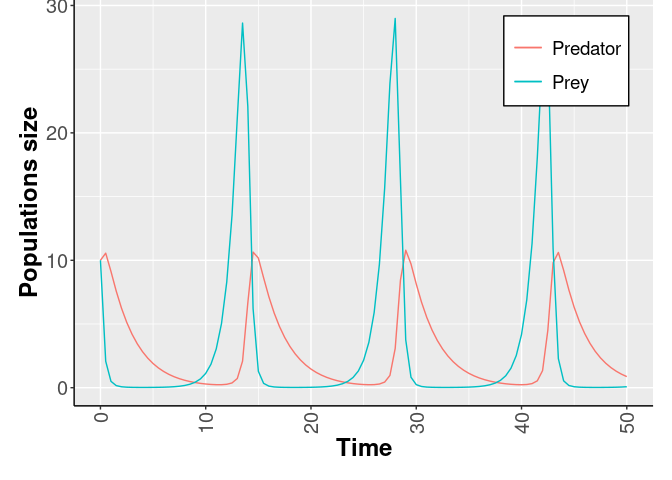

-   [The Lotka–Volterra model](#the-lotkavolterra-model)
-   [First step: call the package](#first-step-call-the-package)
-   [Second step: SPN Model
    generation](#second-step-spn-model-generation)
    -   [Sensitivity analysis](#sensitivity-analysis)
    -   [Calibration analysis](#calibration-analysis)
    -   [Whatif Analysis](#whatif-analysis)
-   [ESPN Model generation](#espn-model-generation)

In this page we show how the and formalisms can be efficiently used to
analyse the Lotka-Volterra model, also known as the *predator-prey
model*.

The Lotka–Volterra model
------------------------

The Lotka-Volterra model is defined by a pair of s, which describes the
dynamics of biological systems characterized by two species that may
interact, one as a predator and the other as prey. From the literature
it is possible to find several definitions of this model, and in a
first classification of these models is reported depending on the
*functional response*, i.e., the change in the rate of prey consumption
by a predator when the prey density varied. In details, the functional
response can be classified in three major types, namely **Holling type
I, II, III**, whose definitions can be summarize as follows.

1.  *Holling type I*: the number of prey consumed shows a linear
    relationship with the prey density, the green line in Fig1.
2.  *Holling type II*: the gradient of the number of prey consumed
    decreases monotonically with increasing prey density, eventually
    saturating at a constant value of prey consumption, the orange line
    in Fig1. This follows from the assumption that the consumer is
    limited by its capacity to process food. A real example of this
    phenomena was published in considering wolves and caribou. It was
    shown that the proportion of caribou killed per wolf decreases as
    caribou density increases, given that wolves are more easily
    satiated and the total number of caribou kills reaches a plateau.
    Mathematically, this model is equivalent to the model of enzime
    kinetics developed in 1913 by L. Michaelis and M. Menten .
3.  *Holling type III*: the gradient of the number of prey consumed
    first increases and then decreases with increasing prey density, the
    blue line in Fig.1. This sigmoidal behaviour has been attributed to
    the existence of ‘learning behaviour’ in the predator population,
    for example predators learning more specialised techniques for
    hunting or prey handling.

Independently by the functional response exploited, a general version of
the prey-predator model is defined by the following s system.

where:

1.  *x**Prey* is the number of preys (e.g., caribou,
    rabbits, etc);
2.  *x**Predator* is the number of predators
    (e.g., wolves, foxes, etc);
3.  *ν* represents time;
4.  *f*(*x**Prey*) is the individual prey growth rate
    in the absence of predators;
5.  *g*(*x**Prey*, *x**Predator*)
    is the functional response of the model;
6.  *ϵ* is the efficiency of the predator in converting consumed prey
    into predator offspring;
7.  *γ* is the predator mortality rate.

First step: call the package
----------------------------

    library(epimod)

Download all the docker images used by *epimod*:

    downloadContainers()

Second step: SPN Model generation
---------------------------------

The simplest and more known prey-predator model exploits a functional
response of type I, in which a predator might interact with all the
prey, thus the product of the two populations is the obvious outcome.
This model can be easily represented using the SPN formalism, see Fig.2,
from which the following ODEs system can be derived:

where:

1.  *x**Prey* is the average number of tokens in the
    *Prey* place, representing the preys;
2.  *x**Predator* is the average number of
    tokens in the *Predator* place, representing the predators;
3.  *α*, *β*, *γ*, *θ* are positive real parameters describing the
    interaction of the two species and defining the rate of the
    *BirthPrey*, *DeathPrey*, *BirthPredator*, *DeathPrey* transitions,
    respectively.

Let use note that Eq.s 2 can be obtained from Eq.s 1 defining
*g*(*x**Prey*, *x**Predator*) = *β* *x**Prey*,
*f*(*x**Prey*) = *α* , and *δ* = *β* *ϵ*.

In this model we are assuming that the prey have an unlimited food
supply and it is able to reproduce exponentially (*BirthPrey*
transition), unless subject to predation (*DeathPrey* transition).
Differently, the food supply of the predator population depends entirely
on the size of the prey population. Thus, the predator birth depends
linearly on the number of prey at a specific time point (*BirthPredator*
transition), while the predators death does not depend on it
(*DeathPredator* transition). We can denote that all the transitions
have a velocity rate defined according to Mass Action (MA) law.

Therefore, starting from the the SPN model saved in the
*./Net/Lotka-Volterra.PNPRO* we can generate the solver which will be
used throughtout the analysis.

    model_generation(net_fname = "./Net/Lotka-Volterra.PNPRO")

### Sensitivity analysis

The R function *sensitivity\_analysis()* implements the sensitivity
analysis taking as input

1.  the file generated by the *model\_generation* function, the total
    number of samplings to be performed,
2.  the final solution time,
3.  the time step defining the frequency at which explicit estimates for
    the system values are desired,
4.  parameters\_fname (*Functions\_list.csv*): a textual file in which
    the parameters to be studied are listed associated with their range
    of variability. significato delle colonne, e che serve il ; come
    sep, spazi non nei path An example is given by the following file,
    where

<!-- -->

    #>   V1    V2               V3                       V4                     V5
    #> 1  i  init  init_generation  min_init = c(0.9 , 0.8)  max_init = c(1.8 , 2)

1.  functions\_fname (*Functions.R*): an R file storing all the
    functions that have to be exploited to generate the associated
    paramter from *parameters\_fname*. In this case we want to generate
    the SPN initial marking exploiting the uniform distribution:

<!-- -->

    init_generation<-function(min_init , max_init)
    {
        # min/max are vectors = first position interval values for the first place
        # and second position for the second place.

       i_1=runif(n=1,min=min_init[1],max=max_init[1])
       i_2=runif(n=1,min=min_init[2],max=max_init[2])

       return( c(i_1,i_2) )
    }

1.  target\_value\_fname (*Target.R*): an R function in which the place,
    w.r.t. the PRCC has to be calculated, must be selected from the
    output data.frame (which represents the output file *.trace*
    reporting the dynamics of each place).

Assuming the following fixed rates: *β* = 4/3, *θ* = 1. Than we change
the prey and predator initial conditions from 200 to 1800, and the prey
and predator birth rates *α*, *γ* from 0.1 to 2, knowing that we are
interested to the trajectory generated with the following values:
*x*(0) = 1000, *y*(0) = 500, *α* = 2/3, *γ* = 1.

#### PRCC and ranking

This step is necessary if we are interested to calculate the PRCC to
identify among the input parameters which are the sensitive ones (i.e.,
those that have a great effect on the model behaviour). This may
simplify the calibration step reducing (1) the number of variables to be
estimated and (2) the search space associated with each estimated
parameter.

In order to run the simulations, the user must provide

1.  the reference dataset;
2.  the definition of a function to compute the distance (or error)
    between the models’ output and the reference dataset itself.

In this case the reference dataset is the trajectory obtained from the
starting point 1 predator and 1 prey. Similarly to the previouos step,
we generate different initial conditions for the system but in this
case.

The function defining the distance takes in inputs only the reference
data and the simulation’s output (i.e. a trajectory); an example it
could be the following:

    msqd<-function(reference, output)
    {
        Predator <- output[,"Predator"]
        Prey <- output[,"Prey"]

        diff.Predator <- sum(( Predator - reference[,2] )^2 )
        diff.Prey <- sum(( Prey - reference[,1] )^2 )

        return(diff.Predator+diff.Prey)
    }

where the squared error between the Predator and Prey trajectories
obtaained from the simulation and the corresponding reference
trajectories are calculated, respectively named *diff.Predator* and
*diff.Prey*. Then, the sum of these errors is returned. Our purpose will
be to minimize (see next section) this function in order to identify the
trajectory most similar to the reference data, therefore

    Target<-function(output)
    {
        ret <- output[,"Predator"]
        return(as.data.frame(ret))
    }

Let us note that the name of the distance and target function must have
the same name of the corresponding R file.

    sensitivity<-sensitivity_analysis(n_config = 30,
                                      parameters_fname = "Input/Functions_list.csv",
                                      functions_fname = "Rfunction/Functions.R",
                                      solver_fname = "Net/Lotka-Volterra.solver",
                                      reference_data = "Input/reference_data.csv",
                                      distance_measure_fname = "Rfunction/msqd.R" ,
                                      target_value_fname = "Rfunction/Target.R" ,
                                      parallel_processors = 2,
                                      f_time = 20,
                                      s_time = .1)

Running the sensisitivity analysis, we can replicate the results
reported on Wikipedia,
*<a href="https://en.wikipedia.org/wiki/Lotka%E2%80%93Volterra_equations" class="uri">https://en.wikipedia.org/wiki/Lotka%E2%80%93Volterra_equations</a>*.
Indeed, textual file for each generated parameter combination (i.e. 20)
containing the system solution is returned. Each file is characterized
by as many rows as the solution time points (obtained dividing the final
time point by the time step) and as many columns as the system
components. We can now generate the phase-space plot, where it is
possible to see that the predators thrive when there are plentiful prey
but, ultimately, outstrip their food supply and decline. As the predator
population is low, the prey population will increase again. These
dynamics continue in a cycle of growth and decline.

Let us note that it is possible to run the sensitivity analysys without
PRCC or ranking, in the case that we are intersted only on to have a
general idea of the simulation’ results.

### Calibration analysis

By exploiting the calibration function we want to calibrate our model in
order to fit the dynamics w.r.t. the reference data, where the fittinf
is defined by the distance implemented in *msqd.R*.

    model_calibration(solver_fname = "Net/Lotka-Volterra.solver",
                      reference_data = "Input/reference_data.csv",
                      distance_measure_fname = "Rfunction/msqd.R" ,
                      f_time = 20,
                      s_time = .1,
                      # Vectors to control the optimization
                      ini_v = c(5,5),
                      ub_v = c(10, 10),
                      lb_v = c(0, 0),
                      max.time = 60 # seconds
    )

### Whatif Analysis

Finally, the periodic dynamics of the system can be obatined running the
model analysis function as follows:

    model_analysis(solver_fname = "Net/Lotka-Volterra.solver",
                      parameters_fname = "Input/Paramters_list.csv",
                      f_time = 50,
                      s_time = .5
    )

In Fig.5 the Lotka-Volterra dynamics are showed fixing: *α* = 1.1,
*β* = 0.4, *γ* = 0.1, *θ* = 0.4, and the initial number of both the
species equals to 10.

References
==========

Keeling, Matt J, and Pejman Rohani. 2011. *Modeling Infectious Diseases
in Humans and Animals*. Princeton University Press.

Kurtz, T. G. 1970. “Solutions of Ordinary Differential Equations as
Limits of Pure Jump Markov Processes.” *J. Appl. Probab.* 1 (7): 49–58.

Marsan, M. Ajmone, G. Balbo, G. Conte, S. Donatelli, and G.
Franceschinis. 1995. *Modelling with Generalized Stochastic Petri Nets*.
New York, NY, USA: J. Wiley.

Pernice, S., M. Pennisi, G. Romano, A. Maglione, S. Cutrupi, F.
Pappalardo, G. Balbo, M. Beccuti, F. Cordero, and R. A. Calogero. 2019.
“A Computational Approach Based on the Colored Petri Net Formalism for
Studying Multiple Sclerosis.” *BMC Bioinformatics*.

Veiga Leprevost, Felipe da, Björn A Grüning, Saulo Alves Aflitos, Hannes
L Röst, Julian Uszkoreit, Harald Barsnes, Marc Vaudel, et al. 2017.
“BioContainers: an open-source and community-driven framework for
software standardization.” *Bioinformatics* 33 (16): 2580–2.

Yang Xiang, Sylvain Gubian, Brian Suomela, and Julia Hoeng. 2012.
“Generalized Simulated Annealing for Efficient Global Optimization: The
GenSA Package for R.” *The R Journal*. <http://journal.r-project.org/>.
