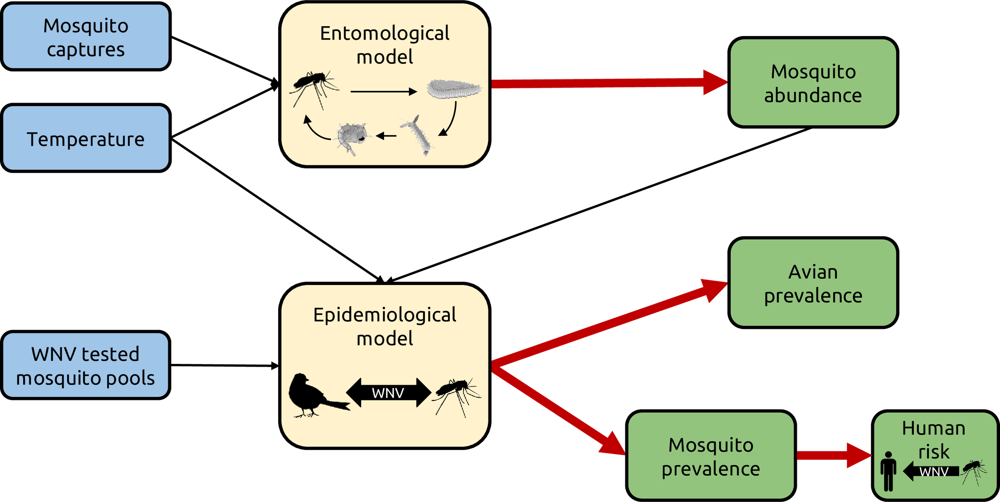
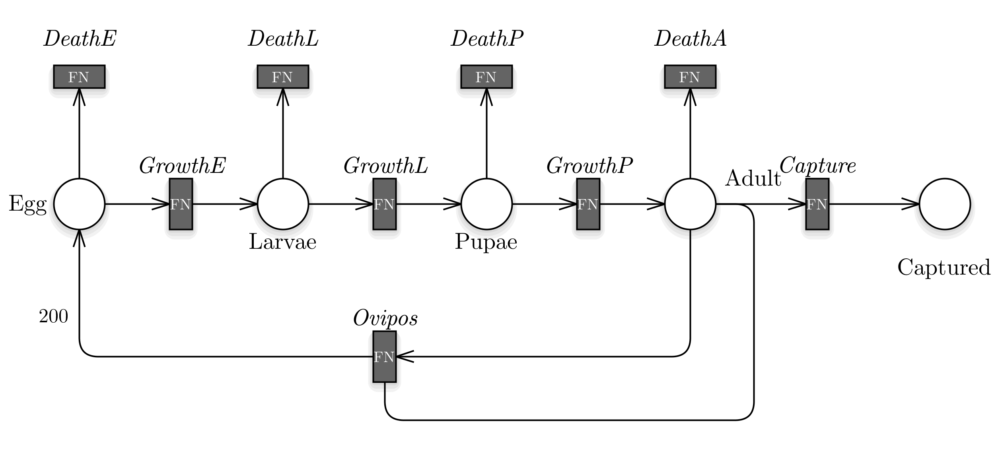

The West Nile Virus (WNV) disease is one of the most recent emerging mosquito-borne diseases in Europe and North America, it is transmitted to birds through the bite of an infected mosquito and mosquitoes become infected by biting infected birds. 

*Model Schema* 

GreatMod is currently being used to study WNV diffusion in the Piedmont region, within the CRT (Cassa di Risparmio di Torino) funded project ”Creation of a computational framework to model and study West Nile Fever” (Cod. ROL: 67410).
 
The West Nile Virus model
------------------------

*This Page is under construction!*

*PN model.* 