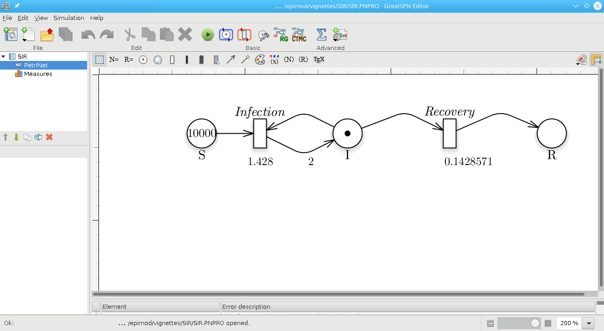
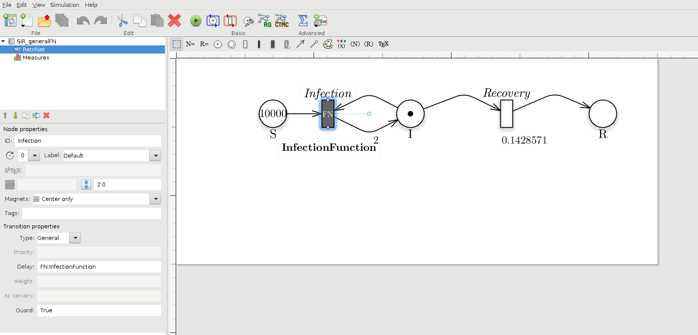
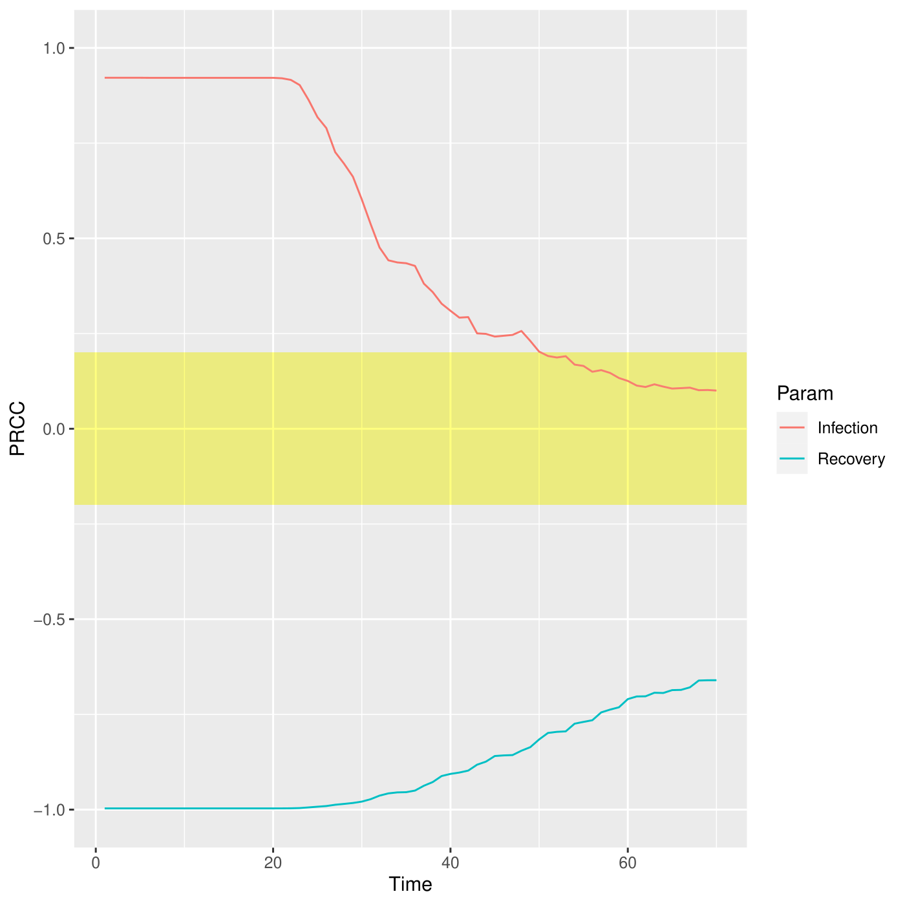

# Introduction

In this document we describe how to use the R library *epimod*. In
details, *epimod* implements a new general modeling framework to study
epidemiological systems, whose novelties and strengths are:

1.  the use of a graphical formalism to simplify the model creation
    phase;
2.  the automatic generation of the deterministic and stochastic process
    underlying the system under study;
3.  the implementation of an R package providing a friendly interface to
    access the analysis techniques implemented in the framework;
4.  a high level of portability and reproducibility granted by the
    containerization (Veiga Leprevost et al. 2017) of all analysis
    techniques implemented in the framework;
5.  a well-defined schema and related infrastructure to allow users to
    easily integrate their own analysis workflow in the framework.

The effectiveness of this framework is showed through the wellknown and
simple SIR model.

# How to start

Before starting the analysis we have to install (1) GreatSPN GUI, (2)
docker, and (3) the R package **devtools** for installing *EPIMOD*.
GreatSPN GUI, the graphical editor for drawing Petri Nets formalisms, is
available online ([link to install
GreatSPN](http://www.di.unito.it/~amparore/mc4cslta/editor.html)), and
it can be installed following the steps showed therein. Then, the user
must have docker installed on its computer for exploiting the *epimod*’s
docker images (for more information on the docker installation see:
[link to install docker](https://docs.docker.com/engine/installation/)),
and to have authorization to execute docker commands reported in the
command page of function install docker. To do this the following
commands must be executed.

1.  Create the docker group.

<!-- -->

        $ sudo groupadd docker

1.  Add your user to the docker group.

<!-- -->

        $ sudo usermod -aG docker $USER

The R package *devtools* has to be installed to run *epimod*:

    install.packages("devtools")
    library(devtools)
    install_github("qBioTurin/epimod", dependencies=TRUE)

    library(epimod)

Then, the following function must be used to download all the docker
images used by *epimod*:

    downloadContainers()

## Something to know

All the *epimod* functions print the following information:

-   *Docker ID*, that is the CONTAINER ID which is executed by the
    function;
-   *Docker exit status*, if 0 then the execution completed with
    success, otherwise an error log file is saved in the working
    directory.

# Cases of study

In this section we show the steps necessary to model, study and analyze
a simple case study. To this aim, we choose to study the diffusion of a
disease following the SIR dynamics. We refer to (Keeling and Rohani
2011) for all the details.

### SIR model

The S-I-R models the diffusion of an infection in a population assuming
three possible states (or compartments) in which any invidual in the
population may move. Specifically, (1) *Susceptible*, individuals
unexposed to the disease, (2) *Infected*, individuals currently infected
by the disease, and (3) *Recovered*, individuals which were successfully
recovered by the infection. To consider the simplest case, we ignore the
population demography (i.e., births and deaths of individuals are
omitted), thus we consider only two possible events: the infection
(passage from *Susceptible* to *Infected*), and the recovery (passage
from *Infected* to *Recovered*). We are also assuming to neglect complex
pattern of contacts, by considering an homogeneous mixing. From a
mathematical point of view, the system behaviors can be investigated by
exploiting the deterministic approach (Kurtz 1970) which approximates
its dynamics through a system of ordinary differential equations (ODEs):

where:

-   *S*, *I*, *R* are the number of susceptible, infected, and recovered
    individuals, respectively;
-   *β* is the infection rate;
-   *N* is the constant population size;
-   *γ* is the recovery rate, which determines the mean infectious
    period.

### Model generation

The first step is the model construction. Starting with the GreatSPN
editor tool it is possible to draw the model using the PN formalism and
its generalizations. We recall that the Petri Nets are bipartite graphs
in which we have two type of nodes, places and transitions. Graphically,
places are represented as circles and those are the variables of our
systems. On the other hand, transitions are depicted as rectangles and
are the possible events happening in the system. Variables and events
(i.e., places and transitions) are connected through arcs, showing what
variable(s) is (are) affected by a specific event. For more details we
refer to (Marsan et al. 1995).

Therefore, as represented in figure , we add one place for each variable
of the system (i.e., S, I, and R represent the susceptible, infected,
and recovered individuals respectively), and one transition for each
possible event (i.e., *Infection* and *Recovery*). Finally, we save the
PN model as a file with extension *.PNPRO* .

Petri Net representation of the SIR model.

Having constructed the model, the generation of both the stochastic (the
Continuous Time Markov Chain) and deterministic (ODEs) processes
underlying the model is implemented by the *model.generation()*
function. This function takes as input the file generated by the
graphical editor, in this case called *SIR.PNPRO*, and automatically
derives the processes.

    model.generation(net_fname = "./Net/SIR.PNPRO")

The binary file *SIR.solver* is generated in which the derived processes
and the library used for their simulation are packaged.

Notice that *model.generation()* might take as input parameter a C++
file defining the functions characterizing the behavior of general
transitions (Pernice et al. 2019), namely *transitions\_fname*. For
instance, if we want to define the transition *Infection* as a general
transition then we have to set the transition as *General* and name the
corresponding rate name as **FN:NameGeneralFN**, where in this case the
*NameGeneralFN* is **InfectionFunction**. As showed in figure , where
the transition type is set to *General* and the delay (i.e., the rate)
to **FN:InfectionFunction**.

Petri Net representation of the SIR model, modelling the Infection
transition as a general transition.

Then, we have to properly define a C++ function implementing the
specific behavior of the transition and save it, for instance in a file
named *transition.cpp*, which has to be structured as follow:

    static double Infection_rate = 1.428;

    double InfectionFunction(double *Value,
                             map <string,int>& NumTrans,
                             map <string,int>& NumPlaces,
                             const vector<string> & NameTrans,
                             const struct InfTr* Trans,
                             const int T,
                             const double& time)
    {

        // Definition of the function exploited to calculate the rate,
        // in this case for semplicity we define it throught the Mass Action  law
     
        double intensity = 1.0;
        
        for (unsigned int k=0; k<Trans[T].InPlaces.size(); k++)
        {
            intensity *= pow(Value[Trans[T].InPlaces[k].Id],Trans[T].InPlaces[k].Card);
        }
        
        double rate = Infection_rate * intensity;

        return(rate);
    }

where the fixed input parameters are:

-   **double \*Value**: marking of the Petri Net at time *time*;
-   **map &lt;string,int>& NumTrans**: association between the
    transition name and the corresponding index of the *NameTrans*
    vector;
-   **map &lt;string,int>& NumPlaces**: association between the place’s
    name and the corresponding index of the *Value* vector;
-   **const vector<string> & NameTrans**: transition names;
-   **const struct InfTr\* Trans**: array of *InfTr* structures
    (implemented in GreatSPN) which is indexed using the transition
    index. The structure *InfTr* has the following fileds: (1)
    *InPlaces*: the input places to a transition, which is characterized
    by the input place index position in the *Value* vector
    (*Trans\[T\].InPlaces\[k\].Id*) and the arc (linking the *k* place
    with the *T* transition) molteplicity
    (*Trans\[T\].InPlaces\[k\].Card*). (2) ….
-   **const int T**: index of the firing transition;
-   **const double& time** : time.

Notice that the function name has to correspond to the rate name
associated with the general transition, in this case
*InfectionFunction*.

Finally, the process can be derived be the *model.generation()* function
as follow.

    model.generation(net_fname = "./Net/SIR_generalFN.PNPRO",
                     transitions_fname = "./Cpp/transition.cpp")

### Sensitivity analysis

The second step is represented by the sensitivity analysis, in which the
deterministic process is solved several times varying the values of the
unknown parameters to identify which are the sensitive ones (i.e., those
that have a greater effect on the model behavior), by exploiting the
Pearson Ranking Correlation Coefficients (PRCCs). This may simplify the
calibration step reducing (1) the number of variables to be estimated
and (2) the search space associated with each estimated parameter. With
this purpose, the function *model.sensitivity()* calculates the PRCCs,
and, given a reference dataset and a distance measure, it ranks the
simulations according to the distance of each solution with respect to
the reference one.

In details, the function *model.sensitivity()* takes in input

1.  **solver\_fname**: the file generated by the *model.generation*
    function, that is *SIR.solver*;
2.  **n\_config**: the total number of samples to be performed, for
    instance 200;
3.  **f\_time**: the final solution time, for instance 10 weeks (70
    days);
4.  **s\_time**: the time step defining the frequency at which explicit
    estimates for the system values are desired, in this case it could
    be set to 1 day;
5.  **parameters\_fname**: a textual file in which the parameters to be
    studied are listed associated with their range of variability. This
    file is defined by three mandatory columns (*which must separeted
    using ;*): (1) a tag representing the parameter type: *i* for the
    complete initial marking (or condition), *m* for the initial marking
    of a specific place, *c* for a single constant rate, and *g* for a
    rate associated with general transitions (Pernice et al. 2019) (the
    user must define a file name coherently with the one used in the
    general transitions file); (2) the name of the transition which is
    varying (this must correspond to name used in the PN draw in
    GreatSPN editor), if the complete initial marking is considered
    (i.e., with tag *i*) then by default the name *init* is used; (3)
    the function used for sampling the value of the variable considered,
    it could be either a R function or an user-defined function (in this
    case it has to be implemented into the R script passed through the
    *functions\_fname* input parameter). Let us note that the output of
    this function must have size equal to the length of the varying
    parameter, that is 1 when tags *m*, *c* or *g* are used, and the
    size of the marking (number of places) when *i* is used. The
    remaining columns represent the input parameters needed by the
    functions defined in the third column. An example is given by the
    file *Functions\_list.csv*, where we decided to vary the rates of
    the *Recovery* and *Infection* transitions by using the R function
    which generates values following the uniform probability
    distribution on the interval from *min* to *max*. We set *n=1*
    because we must generate one value for each sample.

<!-- -->

    #>   Tag         Name Function Parameter1          Parameter2 Parameter3
    #> 1   c     Recovery    runif        n=1           min = 0.1      max=1
    #> 2   c    Infection    runif        n=1         min = 0.001   max=0.01

Another example might be *FunctionsSensitivity\_list.csv*, where we
decide to vary the initial marking using the following function
*init\_generation* defined in the R script *Functions.R* (see
*functions\_fname* parameter).

    Sensitivity_list<-read.csv("Input/FunctionsSensitivity_list.csv", header=FALSE,sep=";")
    colnames(Sensitivity_list) <- c("Tag","Name","Function","Parameter1","Parameter2","Parameter3")
    Sensitivity_list
    #>   Tag       Name Function Parameter1 Parameter2 Parameter3
    #> 1   m          S      100                                 
    #> 2   m          I        1                                 
    #> 3   m          R        0                                 
    #> 4   c   Recovery    runif        n=1    min = 0    max=0.1
    #> 5   c  Infection    runif        n=1    min = 0    max=0.1

1.  **functions\_fname**: an R file storing: 1) the user defined
    functions to generate instances of the parameters summarized in the
    *parameters\_fname* file, and 2) the functions to compute the
    distance (or error) between the model output and the reference
    dataset itself (see *reference\_data* and *distance\_measure*), to
    obtain the place or a combination of places from which the PRCCs
    over the time have to be calculated (see *target\_value*). An
    example is given by *FunctionSensitivity.R*, where three functions
    are implemented: *init\_generation*, *target*, and *mse*.
    *init\_generation* introduced in *FunctionsSensitivity\_list.csv*
    file is defined in order to sample the initial number of susceptible
    between *min\_init* and *max\_init*, and fixing the number of
    infected and recovered to 1 and 0 respectively.

<!-- -->

    init_generation<-function(min_init , max_init, n)
    {
        S=runif(n=1,min=min_init,max=max_init)
    # It returns a vector of lenght equal to 3 since the marking is 
    # defined by the three places: S, I, and R.
        return( c(S, 1,0) )
    }

Differently, *target* is the function to obtain the place or a
combination of places from which the PRCCs over the time have to be
calculated. In details, the function takes in input a *data.frame*,
namely *output*, defined by a number of columns equal to the number of
places plus one corresponding to the time, and number of rows equals to
number of time steps defined previously. Finally, it must return the
column (or a combination of columns) corresponding to the place (or
combination of places) for which the PRCCs have to be calculated for
each time step. In the example the PRCCs are calculated with respect to
place *I* (infected individuals):

    target<-function(output)
    {
        I <- output[,"I"]
        return(I)
    }

Finally, the function *mse* defines the distance measure (based on the
squared error distance) between the reference data and the simulations;
it takes in input only the reference data (defined in
*reference\_data.csv*), and the *simulation output* with the following
structure:

    #>   Time         S         I          R
    #> 1    1 1000.0000  1.000000 0.00000000
    #> 2    2  999.3876  1.557168 0.05518834
    #> 3    3  998.4350  2.423860 0.14110951
    #> 4    4  996.9545  3.770735 0.27481357
    #> 5    5  994.6566  5.860729 0.48271964
    #> 6    6  991.0980  9.096360 0.80563460
    #> 7    7  985.6060 14.087723 1.30628156

Thus, an example of this function can be as follows:

    mse<-function(reference, output)
    {
        reference[1,] -> times_ref
        reference[3,] -> infect_ref

        # We will consider the same time points
        Infect <- output[which(output$Time %in% times_ref),"I"]
        infect_ref <- infect_ref[which( times_ref %in% output$Time)]

        diff.Infect <- 1/length(times_ref)*sum(( Infect - infect_ref )^2 )

        return(diff.Infect)
    }

1.  **target\_value**: the function name to exploit for obtaining the
    PRCCs, which is implemented in *functions\_fname*;
2.  **reference\_data**: a csv file storing the data to be compared with
    the simulations’ result. In *reference\_data.csv* we report the SIR
    evolution starting with 100 susceptible, one infected and zero
    recovered, with a recovery and infection rates equals to 0.04 and
    0.004 respectively. Notice that the **reference\_data**’s rows must
    correspond to the time serie variables (in our example: Susceptible,
    Infected and Recovered) , and so the columns the corresponding
    values at a specific time.

<!-- -->

    #>           Time         I       NA         NA
    #> TimeStep1    0 100.00000 1.000000 0.00000000
    #> TimeStep2    1  99.51983 1.432036 0.04813259
    #> TimeStep3    2  98.83701 2.046008 0.11698044
    #> TimeStep4    3  97.87113 2.913683 0.21518618
    #> TimeStep5    4  96.51503 4.130258 0.35471543
    #> TimeStep6    5  94.63085 5.817282 0.55186756
    #> TimeStep7    6  92.05065 8.121037 0.82831385

1.  **distance\_measure**: the distance function name to exploit for
    ranking the simulations, which is implemented in *functions\_fname*;

Let us observe that: (i) *model.sensitivity* exploits also the parallel
processing capabilities, and (ii) if the user is not interested on the
ranking calculation then the **distance\_measure** and
**reference\_data** are not necessary and can be omitted.

    ## Simple version where only the transition rates vary.
    sensitivity<-model.sensitivity(n_config = 200,
                                   solver_fname = "Net/SIR.solver",
                                   parameters_fname = "Input/FunctionsSensitivity_list.csv", 
                                   reference_data = "Input/reference_data.csv",
                                   functions_fname = "Rfunction/FunctionSensitivity.R",
                                   distance_measure = "mse" ,
                                   target_value = "target" ,
                                   i_time = 0,
                                   f_time = 7*10, # weeks
                                   s_time = 1, # days  
                                   parallel_processors = 2
    )

    #> [1] "[experiment.env_setup] Setting up environment"
    #> [1] "[experiment.env_setup] Done setting up environment"
    #> docker run --privileged=true  --user=501:20 --cidfile=dockerID --volume /Users/simonepernice/Desktop/GIT/Modelli_GreatMod/SIR:/home/docker/data -d qbioturin/epimod-sensitivity:1.0.0 Rscript /usr/local/lib/R/site-library/epimod/R_scripts/sensitivity.mngr.R /home/docker/data/SIR_sensitivity/params_SIR-sensitivity.RDS
    #> 
    #> 
    #> Docker ID is:
    #>  4599165d1b85 
    #> .....
    #> 
    #> 
    #> Docker exit status: 0

Hence, considering the SIR model we can run the *model.sensitivity*
varying the *Infection* and *Recovery* transitions rates in order to
characterized their effect on the number of infected individuals.

The 200 trajectories considering the I place obtained from different
parameters configurations.

The 200 trajectories considering the S place obtained from different
parameters configurations.

The 200 trajectories considering the R place obtained from different
parameters configuration.

Scatter plot showing the squared error between the reference data and
simulated number of infected. The dark blue points represent the
parameters configuration with minimum error.

From the figures , , and , it is possible to observe the different
trajectories obtained by solving the system of ODEs, represented by eq.
, with different parameters configurations, sampled by exploiting the
function passed through **parameters\_fname**. In figure the distance
values, obtained using the measure definition described before, are
plotted varying the *Recovery* parameter (on the x-axis) and *Infection*
parameter (on the y-axis). Each point is colored according to a
nonlinear gradient function starting from color dark blue (i.e., lower
value) and moving to color light blue (i.e., higher values). From this
plot we can observe that lower squared errors are obtained when
*Recovery* is around 0.025 and *Infection* around 0.002, thus we can
reduce the search space associated with the two parameters around these
two values.

PRCC for the I place over time.

The PRCCs values for these two parameters, depicted in figure , with
respect the number of infections over the entire simulated period are
both meaningful, especially in the first part of the simulation,
corresponding to the transient part where the parameters affect mostly
the output. Differently, this effect decreases after the fifth week
where all the deterministic trajectories obtained with different
parameters configurations converge to the same states, see figure .

Other possible examples of how to use this function are reported
hereafter:

    ## Version where only the PRCC is calculated
    sensitivity<-model.sensitivity(n_config = 100,
                                   solver_fname = "Net/SIR.solver",
                                   parameters_fname = "Input/Functions_list.csv", 
                                   functions_fname = "Rfunction/FunctionSensitivity.R",
                                   target_value = "target" ,
                                   parallel_processors = 1,
                                   f_time = 7*10, # weeks
                                   s_time = 1 # days
                                   )

    ## Version where only the ranking is calculated
    sensitivity<-model.sensitivity(n_config = 100,
                                   solver_fname = "Net/SIR.solver",
                                   parameters_fname = "Input/Functions_list.csv", 
                                   functions_fname = "Rfunction/FunctionSensitivity.R",
                                   reference_data = "Input/reference_data.csv",
                                   distance_measure = "mse" ,
                                   parallel_processors = 1,
                                   f_time = 7*10, # weeks
                                   s_time = 1 # days
                                   )

    ## Complete and more complex version where all the parameters for calculating
    ## the PRCC and the ranking are considered, and the initial conditions vary too.

    sensitivity<-model.sensitivity(n_config = 100,
                                   solver_fname = "Net/SIR.solver",
                                   parameters_fname = "Input/Functions_list.csv", 
                                   reference_data = "Input/reference_data.csv",
                                   functions_fname = "Rfunction/FunctionSensitivity.R",
                                   distance_measure = "mse" ,
                                   target_value = "target" ,
                                   f_time = 7*10, # weeks
                                   s_time = 1, # days  
                                   parallel_processors = 2
                                   )

#### Sensitivity analysis with general transitions

Let us consider the example of the SIR model where the *Infection*
transition is defined as general transition, with the porpoise to
varying the *Infection\_rate* constant of the corresponding Mass Action
law. Generally, in order to define the rate of a transition it is
required to provide some inputs and, hence, we need to define an R
function (in the **functions\_fname** file) which provides all the input
parameters necessary to the C++ function.

Therefore, we have to modify the *Functions\_list* csv as follow in
order to associate with the general transition *Infection* the R
function, *InfectionValuesGeneration*, which generates the values
exploited by the respective function defined in the C++ file, called
*trasition.cpp*.

    #>   Tag       Name                   Function Parameter1 Parameter2 Parameter3
    #> 1   c   Recovery                      runif        n=1    min = 0      max=1
    #> 2   g  Infection  InfectionValuesGeneration    min = 0      max=1

Successively, we have to define the *InfectionValuesGeneration* in
*Functions.R*.

    InfectionValuesGeneration<-function(min, max)
    {
        rate_value <-  runif(n=1, min = min, max = max)
        return(rate_value)
    }

Notice that the value (or values) generated are temporarily saved in a
file named as the corresponding name in the *Functions\_list*, in this
case *Infection*. Hence, the file *transition.cpp* has to be modified in
order to read and use the value generated from the R function
*InfectionValuesGeneration*. An example of implementation is the
following, where two functions are defined: (1) *read\_constant()* in
order to read the generated value, which is associated with the right
variable, and (2) *init\_data\_structures()* in order to read the file
only the first time that the function is called.

    static double Flag = -1; 
    static double Infection_rate = 1.428;

    void read_constant(string fname, double& Infection_rate)
    {
        ifstream f (fname);
        string line;
        if(f.is_open())
        {
            int i = 1;
            while (getline(f,line))
            {
                switch(i)
                {
                    case 1:
                        Infection_rate = stod(line);
                        //cout << "p" << i << ": " << line << "\t" << p1 << endl;
                        break;
                }
                ++i;
            }
            f.close();
        }
        else
        {
            std::cerr<<"\nUnable to open " << fname << 
                    ": file do not exists\": file do not exists\n";
            exit(EXIT_FAILURE);
        }
    }

    void init_data_structures()
    {
        read_constant("./Infection", Infection_rate);
        Flag = 1; 

    }

    double InfectionFunction(double *Value,
                             map <string,int>& NumTrans,
                             map <string,int>& NumPlaces,
                             const vector<string> & NameTrans,
                             const struct InfTr* Trans,
                             const int T,
                             const double& time)
    {

        // Definition of the function exploited to calculate the rate,
        // in this case for semplicity we define it throught the Mass Action  law
     
        if( Flag == -1)   init_data_structures();
     
        double intensity = 1.0;
        
        for (unsigned int k=0; k<Trans[T].InPlaces.size(); k++)
        {
            intensity *= pow(Value[Trans[T].InPlaces[k].Id],Trans[T].InPlaces[k].Card);
        }
        
        double rate = Infection_rate * intensity;

        return(rate);
    }

### Calibration analysis

The aim of this phase is to optimize the fit of the simulated behavior
to the reference data by adjusting the parameters associated with both
Recovery and Infection transitions. This step is performed by the
function *model.calibration()*, characterized by the solution of an
optimization problem in which the distance between the simulated data
and the reference data is minimized, according to the definition of
distance provided by the user (**distance\_fname**).

    model.calibration(parameters_fname = "Input/Functions_list_Calibration.csv",
                      functions_fname = "Rfunction/FunctionCalibration.R",
                      solver_fname = "Net/SIR.solver",
                      reference_data = "Input/reference_data.csv",
                      distance_measure = "mse" ,
                      f_time = 7*10, # weeks
                      s_time = 1, # days
                      # Vectors to control the optimization
                      ini_v = c(0.02,0.001),
                      lb_v = c(0.01, 0.0001),
                      ub_v = c(0.05, 0.002),
                      max.time = 2
                    )

    #> [1] "[experiment.env_setup] Setting up environment"
    #> [1] "[experiment.env_setup] Done setting up environment"
    #> docker run --privileged=true  --user=501:20 --cidfile=dockerID --volume /Users/simonepernice/Desktop/GIT/Modelli_GreatMod/SIR:/home/docker/data -d qbioturin/epimod-calibration:1.0.0 Rscript /usr/local/lib/R/site-library/epimod/R_scripts/calibration.mngr.R /home/docker/data/SIR_calibration/params_SIR-calibration.RDS
    #> 
    #> 
    #> Docker ID is:
    #>  090eae087a7d 
    #> .......
    #> 
    #> 
    #> Docker exit status: 0
    #> [1] 0

1.  **solver\_fname**: the file generated by the *model.generation*
    function, that is *SIR.solver*;
2.  **parameters\_fname**: a textual file in which the parameters to be
    studied are listed associated with their range of variability. This
    file is defined by three mandatory columns (*which must separeted
    using ;*): (1) a tag representing the parameter type: *i* for the
    complete initial marking (or condition), *m* for the initial marking
    of a specific place, *c* for a single constant rate, and *g* for a
    rate associated with general transitions (Pernice et al. 2019) (the
    user must define a file name coherently with the one used in the
    general transitions file); (2) the name of the transition which is
    varying (this must correspond to name used in the PN draw in
    GreatSPN editor), if the complete initial marking is considered
    (i.e., with tag *i*) then by default the name *init* is used; (3)
    the function used for sampling the value of the variable considered,
    it could be either a R function or an user-defined function (in this
    case it has to be implemented into the R script passed through the
    *functions\_fname* input parameter). Let us note that the output of
    this function must have size equal to the length of the varying
    parameter, that is 1 when tags *m*, *c* or *g* are used, and the
    size of the marking (number of places) when *i* is used. The
    remaining columns represent the input parameters needed by the
    functions defined in the third column. An example is given by the
    file *Functions\_list\_Calibration.csv*:

<!-- -->

    #>   Tag       Name Function or fixed parameter NA
    #> 1   m          S                         100 NA
    #> 2   m          I                           1 NA
    #> 3   m          R                           0 NA
    #> 4   c   Recovery                fun.recovery NA
    #> 5   c  Infection               fun.infection NA

where the rates of the *Recovery* and *Infection* transitions can be
calibrated by using the R functions stored in the R script
*functions\_fname*; 3. **functions\_fname**: an R file storing: 1) the
user defined functions to generate instances of the parameters
summarized in the *parameters\_fname* file, and 2) the function to
compute the distance (or error) between the model output and the
reference dataset itself. An example is given by
*FunctionCalibration.R*, where three functions are implemented:
*fun.recovery*, *fun.infection*, and *mse*. The first two are introduced
in *Functions\_list\_Calibration.csv* file, and they are defined in
order to return the value (or a linear transformation) of the vector of
the unknown parameters generated from the optimization algorithm, namely
**optim\_v**, whose size is equal to number of parameters in
*parameters\_fname*. Let us note that the output of these functions must
return a value for each input parameter. For instance, to calibrate the
transition rates associated with *Recovery* and *Infection*, the
functions recovery and infection have to be defined, returning just the
corresponding value from the vector **optim\_v**, where
**optim\_v\[1\]** = *“Recovery rate”*, **optim\_v\[2\]** = *“Infection
rate”*, since we do not want to change the vector generated from the
optimization algorithm. The order of values in **optim\_v** is given by
the order of the parameters in *parameters\_fname*. Finally, the
function *mse* defines the distance measure (based on the squared error
distance) between the reference data and the simulations; it takes in
input only the reference data (defined in *reference\_data.csv*), and
the *simulation output* with the following structure:

    #>   Time         S         I          R
    #> 1    1 1000.0000  1.000000 0.00000000
    #> 2    2  999.3876  1.557168 0.05518834
    #> 3    3  998.4350  2.423860 0.14110951
    #> 4    4  996.9545  3.770735 0.27481357
    #> 5    5  994.6566  5.860729 0.48271964
    #> 6    6  991.0980  9.096360 0.80563460
    #> 7    7  985.6060 14.087723 1.30628156

Thus, these three functions are defined as follows:

    fun.recovery<-function(optim_v)
    {
        return(optim_v[1])
    }

    fun.infection<-function(optim_v)
    {
        return(optim_v[2])
    }

    mse<-function(reference, output)
    {
        reference[1,] -> times_ref
        reference[3,] -> infect_ref

        # We will consider the same time points
        Infect <- output[which(output$Time %in% times_ref),"I"]
        infect_ref <- infect_ref[which( times_ref %in% output$Time)]

        diff.Infect <- 1/length(times_ref)*sum(( Infect - infect_ref )^2 )

        return(diff.Infect)
    }

1.  **reference\_data**: a csv file storing the data to be compared with
    the simulations’ result. In *reference\_data.csv* we report the SIR
    evolution starting with 100 susceptible, one infected and zero
    recovered, with a recovery and infection rates equals to 0.04 and
    0.004 respectively. Notice that the **reference\_data**’s rows must
    correspond to the time serie variables (in our example: Susceptible,
    Infected and Recovered) , and so the columns the corresponding
    values at a specific time.

<!-- -->

    #>           Time         I       NA         NA
    #> TimeStep1    0 100.00000 1.000000 0.00000000
    #> TimeStep2    1  99.51983 1.432036 0.04813259
    #> TimeStep3    2  98.83701 2.046008 0.11698044
    #> TimeStep4    3  97.87113 2.913683 0.21518618
    #> TimeStep5    4  96.51503 4.130258 0.35471543
    #> TimeStep6    5  94.63085 5.817282 0.55186756
    #> TimeStep7    6  92.05065 8.121037 0.82831385

1.  **distance\_measure**: the distance function name to exploit for
    ranking the simulations, which is implemented in *functions\_fname*;
2.  **f\_time**: the final solution time, for instance 10 weeks (70
    days);
3.  **s\_time**: the time step defining the frequency at which explicit
    estimates for the system values are desired, in this case it could
    be set to 1 day;
4.  **ini\_v**: Initial values for the parameters to be optimized.
5.  **lb\_v, ub\_v**: Vectors with length equal to the number of
    parameters which are varying. Lower/Upper bounds for each parameter.
6.  **max\_time**: maximum running time.

<!-- -->

    # How to generate the plots

    source("Rfunction/CalibrationPlot.R")

    plots <- calibration.plot(solverName_path = "./SIR_calibration/SIR-calibration-1.trace",
                              reference_path ="reference_data.csv")
    plots$plS
    plots$plI
    plots$plR

Trajectories considering the S place.

Trajectories considering the I place.

Trajectories considering the R place.

In figures , and the trajectories with color depending on the squared
error w.r.t. reference trend are plotted. In this case, fixing a maximum
number of objective function calls, we obtain the following optimal
value for the two parameters:

    #> [1] 0.04462931 0.00200000

#### Calibration analysis with general transitions

Starting from the changes made in the Sensitivity Analysis phase, we
have to add the possibility to save the value passed by the optmization
algorithm instead of the value generated by the function defined by the
user. By default in the calibration phase, the vector *x* of the unknown
parameters, in this case the *Recovery* and *Infection* rates, is passed
to the R functions defined in *Functions.R*. Therefore, we have to
modify the *InfectionValuesGeneration* in order to return the value
contained in *x*, i.e. the second one ( the order is given by the order
of the parameters in **parameters\_fname**). Notice that in the
Sensitivity Analisys phase, the vector *x* is not passed in input so we
can generalized the *InfectionValuesGeneration* as follow in order to
use it in both the analysis phases.

    InfectionValuesGeneration<-function(optim_v= NULL)
    {
        rate_value <- optim_v[2]
        
        return(rate_value)
    }

### Model Analysis

Finally, a possible step is the model analysis, where the corresponding
function *model.analysis()* executes and tests the behavior of the
developed model. Furthermore, by changing the input parameters, it is
possible to perform a *what-if* analysis or forecasting the evolution of
the diffusion process.

    model.analysis(solver_fname = "SIR.solver",
                   i_time = 1,
                   f_time = 100, # days
                   s_time = 1,
                   parameters_fname = "Functions_list_ModelAnalysis.csv"
                   )

1.  **solver\_fname**: the file generated by the *model.generation*
    function, that is *SIR.solver*;
2.  **i\_time**: the initial solution time, for instance day 1;
3.  **f\_time**: the final solution time, for instance 100 days;
4.  **s\_time**: the time step defining the frequency at which explicit
    estimates for the system values are desired, in this case it could
    be set to 1 day.
5.  **parameters\_fname**: a textual file in which the parameters to be
    studied are listed associated with their range of variability. This
    file is defined by three mandatory columns (*which must separeted
    using ;*): (1) a tag representing the parameter type: *i* for the
    complete initial marking (or condition), *m* for the initial marking
    of a specific place, *c* for a single constant rate, and *g* for a
    rate associated with general transitions (Pernice et al. 2019) (the
    user must define a file name coherently with the one used in the
    general transitions file); (2) the name of the transition which is
    varying (this must correspond to name used in the PN draw in
    GreatSPN editor), if the complete initial marking is considered
    (i.e., with tag *i*) then by default the name *init* is used; (3)
    the function used for sampling the value of the variable considered,
    it could be either a R function or an user-defined function (in this
    case it has to be implemented into the R script passed through the
    *functions\_fname* input parameter). Let us note that the output of
    this function must have size equal to the length of the varying
    parameter, that is 1 when tags *m*, *c* or *g* are used, and the
    size of the marking (number of places) when *i* is used. The
    remaining columns represent the input parameters needed by the
    functions defined in the third column.

<!-- -->

    Functions_list_ModelAnalysis<-read.csv("Input/Functions_list_ModelAnalysis.csv", header=FALSE,sep=";")
    colnames(Functions_list_ModelAnalysis) <- c("Tag","Name","Function or fixed parameter")
    Functions_list_ModelAnalysis
    #>   Tag      Name Function or fixed parameter NA
    #> 1   m         S                       1e+02 NA
    #> 2   m         I                       1e+00 NA
    #> 3   m         R                       0e+00 NA
    #> 4   c  Recovery                       4e-02 NA
    #> 5   c Infection                       4e-03 NA

    ## How to generate the plots

    source("Rfunction/ModelAnalysisPlot.R")

    AnalysisPlot = ModelAnalysisPlot(trace_path = "./SIR_analysis/SIR-analysys-1.trace",
                                     Stoch = F,
                                     print=F)
    AnalysisPlot$plAll

Deterministic Trajectory considering all places

It is possible also to simulate the stochastic behavior of the system
exploiting the Gillespie algorithm, namely **SSA**, which is an exact
stochastic method widely used to simulate chemical systems whose
behavior can be described by the Master equations.

    model.analysis(solver_fname = "SIR.solver",
                   parameters_fname = "Functions_list_ModelAnalysis.csv",
                   solver_type = "SSA",
                   n_run = 500,
                   parallel_processors = 2,
                   i_time = 1,
                   f_time = 100, # days
                   s_time = 1
    )

1.  **solver\_type**: type of solver to use;

2.  **n\_run**: number of stochastic simulations to run.

3.  **solver\_type**: type of solver to use;

4.  **n\_run**: number of stochastic simulations to run.

<!-- -->

    ## How to generate the plots

    source("Rfunction/ModelAnalysisPlot.R")

    AnalysisPlot = ModelAnalysisPlot(trace_path = "./SIR_analysis/SIR-analysis-1.trace",
                                     Stoch = T)
    AnalysisPlot$plAll
    AnalysisPlot$plAllMean

Stochastic Trajectories considering the S place.

Stochastic Trajectories considering the I place.

#### What-if analysis

It is possible to change the place marking directly from the
*parameters\_fname*:

    Functions_list_ModelAnalysis<-read.csv("Input/Functions_list_ModelAnalysis2.csv", header=FALSE,sep=";")
    colnames(Functions_list_ModelAnalysis) <- c("Tag","Name","Function or fixed parameter")
    Functions_list_ModelAnalysis
    #>   Tag      Name Function or fixed parameter NA
    #> 1   m         S                       1e+02 NA
    #> 2   m         I                       5e+00 NA
    #> 3   m         R                       0e+00 NA
    #> 4   c  Recovery                       4e-02 NA
    #> 5   c Infection                       4e-03 NA

# References

Keeling, Matt J, and Pejman Rohani. 2011. *Modeling Infectious Diseases
in Humans and Animals*. Princeton University Press.

Kurtz, T. G. 1970. “Solutions of Ordinary Differential Equations as
Limits of Pure Jump Markov Processes.” *J. Appl. Probab.* 1 (7): 49–58.

Marsan, M. Ajmone, G. Balbo, G. Conte, S. Donatelli, and G.
Franceschinis. 1995. *Modelling with Generalized Stochastic Petri Nets*.
New York, NY, USA: J. Wiley.

Pernice, S., M. Pennisi, G. Romano, A. Maglione, S. Cutrupi, F.
Pappalardo, G. Balbo, M. Beccuti, F. Cordero, and R. A. Calogero. 2019.
“A Computational Approach Based on the Colored Petri Net Formalism for
Studying Multiple Sclerosis.” *BMC Bioinformatics*.

Veiga Leprevost, Felipe da, Björn A Grüning, Saulo Alves Aflitos, Hannes
L Röst, Julian Uszkoreit, Harald Barsnes, Marc Vaudel, et al. 2017.
“BioContainers: an open-source and community-driven
framework for software standardization.” *Bioinformatics* 33
(16): 2580–82.
