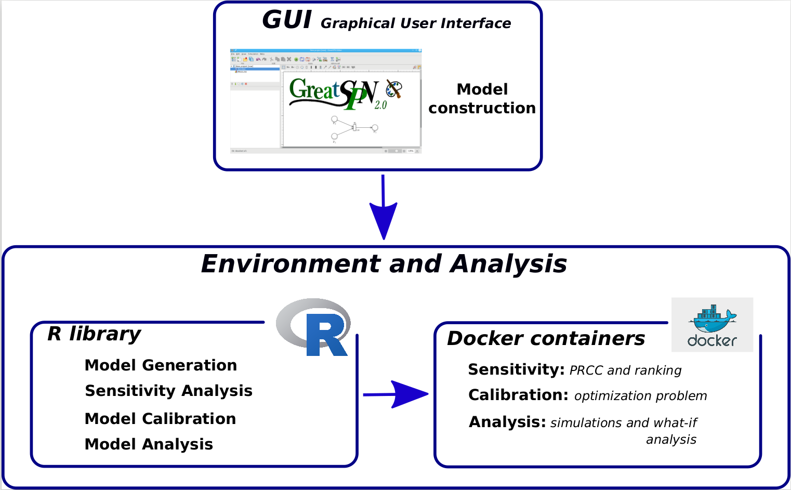
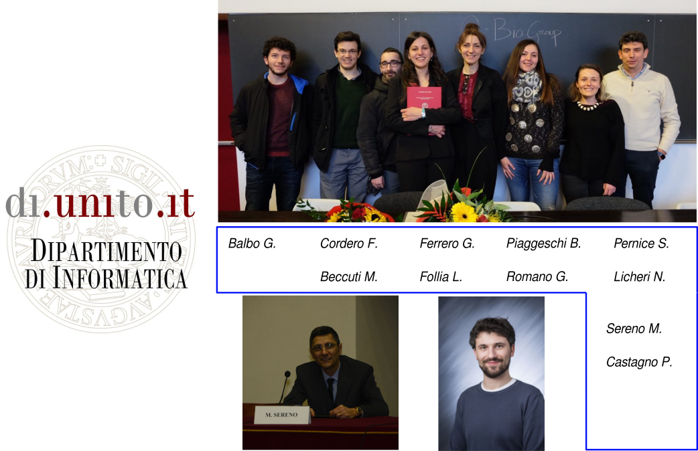

# Introduction
**GreatMod** represents a new way of facing the modeling analysis, exploiting the high-level graphical formalism, called Petri Net (PN), and its generalizations, which provide a compact, parametric and intuitive graphical description of the system and automatically derivation of the low-level mathematical processes (either deterministic and stochastic) characterizing the system dynamics.
The framework strengths can be summarized into four points:

1. the use of a graphical formalism to simplify  the model creation phase exploiting the *GreatSPN* GUI; 
2. the implementation of an R package, **EPIMOD**, providing  a friendly interface  to access the analysis techniques (from the sensitivity analysis and calibration of the parameters to the model simulation); 
3. a high level of portability and reproducibility granted by  the containerization of all analysis techniques implemented in the framework; 
4. a well-defined schema and related infrastructure to allow users to easily integrate their own analysis workflow in the framework.

The following image shows the framework schema depicting its modules and its functionalities from a user point of view.


### Install GreatSPN
The installation of the workflow requires the downloading of the extended version of the [*GreatSPN* editor](http://www.di.unito.it/~amparore/mc4cslta/editor.html).

### Install EPIMOD
To install **EPIMOD** you can use use **devtools**:

```
install.packages("devtools")
library(devtools)
install_github("https://github.com/qBioTurin/epimod", ref="master")
```

#### Download Containers
To download all the docker images exploited by **EPIMOD**  you can use:

```
library(epimod)
downloadContainers()
```


### Requirements
You need to have docker installed on your machine, for more info see this document:
https://docs.docker.com/engine/installation/.

Ensure your user has the rights to run docker (witout the use of ```sudo```). To create the docker group and add your user:

* Create the docker group.

```
  $ sudo groupadd docker
```
* Add your user to the docker group.

```
  $ sudo usermod -aG docker $USER
```
* Log out and log back in so that your group membership is re-evaluated.


### Repository


The following list is a selection of project developed with **EPIMOD**, providing both the necessary files and explainations to perform the anlaysis. If you find any issue while running projecte listed here, please contact the person or group responsible for such project and not **EPIMOD** developers team. 

**Step-by-step applications**
* [SIR](https://github.com/qBioTurin/SIR): The SIR model is one of the simplest compartmental models, and many models are derivatives of this basic form. The model consists of three compartments: S for the number of susceptible, I for the number of infectious, and R for the number of recovered or deceased (or immune) individuals ([more information](https://en.wikipedia.org/wiki/Compartmental_models_in_epidemiology)). This simple model is presented as an introduction to the *epimod* usage, showing step by step both base and advanced *epimod*'s functionalities.
* [Lotka-Volterra](https://github.com/qBioTurin/Lotka-Volterra): The Lotka–Volterra equations, also known as the predator–prey equations, are a pair of first-order nonlinear differential equations, frequently used to describe the dynamics of biological systems in which two species interact, one as a predator and the other as prey ([more information](https://en.wikipedia.org/wiki/Lotka%E2%80%93Volterra_equations)). This simple model is presented as an introduction to the *epimod* usage, showing step by step *epimod*'s base functionalities. 

**Complex applications**
* [Pertussis](https://github.com/qBioTurin/Pertussis): The pertussis model has been developed by the University of Turin in a joint work with [Adres](http://www.adreshe.com/) and [ISI Foundation](https://www.isi.it/en/home). The model allows to study the evolution of the Pertussis through several decades, starting from mid 70's, and the effects of the governamental vaccination policies. 
* [COVID-19](https://github.com/qBioTurin/COVID-19): The coronavirus disease 19 (COVID-19) is viral infection highly transmittable caused by severe acute respiratory syndrome coronavirus 2 (SARS-CoV-2). In February 21<sup>st</sup>, 2020 the first person-to-person transmission of SARS-CoV-2 was reported in Italy. Afterwards, the number of people infected with COVID-19 increased rapidly, firstly in northern Italian regions and then it rapidly expands in all Italian territories. The model available here has been developed by the University of Turin and has been succesfully employed to study the pathogen diffusion in the Piedmonnt region.  
* [Multiple Sclerosis](https://github.com/qBioTurin/Multiple-Sclerosis): Multiple Sclerosis (MS) represents nowadays in  Europe the leading cause of non-traumatic disabilities in young adults, with more than 700,000 EU cases.  We propose  a new model to study the immune response in relapsing remitting MS (RRMS), the most common form of MS that is characterized by alternate episodes of symptom exacerbation (relapses) with periods of disease stability (remission). In this new model, both the peripheral lymph node/blood  vessel and the central nervous system are explicitly represented. Simulation results have proven the ability of the model to reproduce *in silico* the immune T cell balance characterizing RRMS course and the DAC effects. Furthermore, they confirmed the importance of a timely intervention on the disease course.

### Bibliography
* [A computational framework for modeling and studying pertussis epidemiology and vaccination.](https://bmcbioinformatics.biomedcentral.com/articles/10.1186/s12859-020-03648-6) P. Castagno, S. Pernice, G. Ghetti, M. Povero, L. Pradelli, D. Paolotti, G. Balbo, M. Sereno and M. Beccuti. BMC Bioinformatics, Volume 21, 16 September 2020, Page 344.

* [Computational modeling of the immune response in multiple sclerosis using epimod framework.](https://bmcbioinformatics.biomedcentral.com/articles/10.1186/s12859-020-03823-9) S. Pernice, L. Follia, A. Maglione, M. Pennisi, F. Pappalardo, F. Novelli, M. Clerico, M. Beccuti, F. Cordero, S. Rolla.  BMC Bioinformatics, Volume 21, Article number: 550 (2020).

* [Impacts of reopening strategies for COVID-19 epidemic: a modeling study in Piedmont region.](https://bmcinfectdis.biomedcentral.com/articles/10.1186/s12879-020-05490-w) S. Pernice, P. Castagno, L. Marcotulli, M. M. Maule, L. Richiardi, G. Moirano, M. Sereno, F. Cordero and M. Beccuti. BMC Infectious Diseases, Volume 20, Article number: 798 (2020).

### Group

[**QbioTurin**](https://www.cs.unito.it/do/gruppi.pl/Show?_id=lxu3)



### Disclaimer
**EPIMOD**  developers have no liability for any use of **EPIMOD**  functions, including without limitation, any loss of data, incorrect results, or any costs, liabilities, or damages that result from use of **EPIMOD** . 
